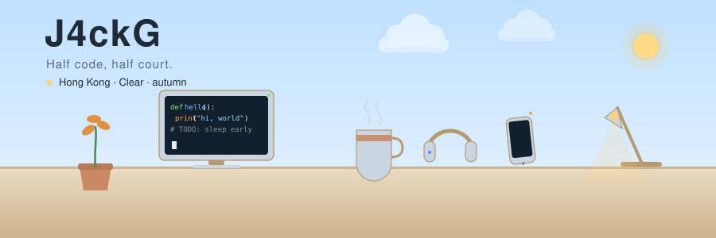

<!-- ============ Desk Header (Hong Kong weather · day / night follows your theme) ============ -->

  <picture>
    <source media="(prefers-color-scheme: dark)" srcset="desk-night.svg" />
    
  </picture>

A lot of people ask me why I went to Hong Kong for grad school.

I said I wanted to see for myself — **which comes first: a city's dusk, or a programmer's.**

Later I found out: what comes first is the 4 a.m. bug.

***

I've always felt that a self-introduction is the cheapest thing in this era. Words can be packaged, personas can be retouched — only commits don't lie. So I'm not here to hype myself up as anyone. I'll just say:

> **The world never lacks ordinary people; it lacks people who can live the ordinary at full resolution.** And my screen's resolution is still being tuned.
> **Okay, this line was generated by AI too.**

## About Me

- 🎓 **Grad student** — Hong Kong. Half of me is researching code, the other half is researching how to survive an 8 a.m. class.
- 🧠 **Life Style** — thinks a lot, does very little. Other people's lives have plans; my plan is "let's just leave it like this for now."
- 🏀 **Basketball** — a miss is a miss, unlike a paper, which you finish without knowing what you wrote.
- 🔌 **Gadgets** — I love anything with a battery, a network connection, or an upgrade path. Buy it, boot it, upgrade it, then discover a three-year-old device does the same job. **A lot like me going from undergrad to grad school.**
- ☕ **Sleep schedule** — Beta version. A worm by day, a dragon by night; my body clock runs on an alien timezone.

## What I'm Up To

> `Now` Studying hard · slacking off hard · researching the next device worth my money 
> `Planned` Find a job · lose 10 jin · finally finish that diary I've put off for half a year 
> `Done` Opening the editor

<!-- ============ Tech Garden ============ -->

🖥️ &nbsp;<b>Field guide</b> — every chip, explained (click to see what each one does)

 

 
 
 
 

## Status Board

<picture>
  <source media="(prefers-color-scheme: dark)" srcset="streak-night.svg" />
  
</picture>

  

## One Last Line

> 通常写在深夜，第二天早上就删了。
> 所以你能读到这一段，说明我还没来得及后悔。

  
   
  
  
  

